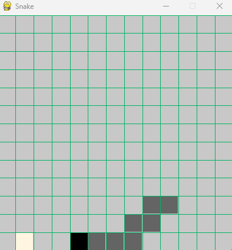

# D3QN Snake

[中文版](#ddqn-贪吃蛇)

A greedy snake AI using reinforcement learning, which can work after only a few minutes of training

Used skills including experience playback, double Q learning, and dueling network [enhanced learning DQN quick start](https://blog.csdn.net/qq_32461955/article/details/126040912)

The project also uploaded 2 models trained for 5 hours on the CPU



## Usages

### Requirement

- `numpy=1.22.4`
- `matplotlib=3.5.1`
- `pygame=2.1.2`
- `tqdm=4.64.0`
- `torch=1.13.0`
### How to start

#### Demo

- Play only, no training: `python ddqn.py --visual 2 --play --model_load history-2022-12-18-03-28-52/model_33300.pkl`

#### Training

- From just being able to move to being able to eat about 8 foods (6 minutes): `python ddqn.py --visual 1 --step 100000 --model_load history-2022-12-18-09-38-36/model_10000.pkl --model_save tmp.pkl`

- From 0 to convergence (50 minutes): `python ddqn.py --visual 1 --step 1000000 -norender --model_save tmp.pkl`

### Further usages

For further usage, see `python ddqn.py -h`
```cmd
usage: ddqn.py [-h] [--step STEP] [--history HISTORY] [--render RENDER] [--train] [--play] [--visual VISUAL]
               [--model_load MODEL_LOAD] [--model_save MODEL_SAVE] [--test TEST] [--epsilon EPSILON] [--log]

optional arguments:
  -h, --help            show this help message and exit
  --step STEP           the number of step it will train
  --history HISTORY     after HISTORY generations, save model every 1000 generations
  --render RENDER       render level while training, 0: no render, 1: render once after die, 2[default]: render every step
  --train               only train
  --play                only play
  --visual VISUAL       the manhattan distance that snakes can see
  --model_load MODEL_LOAD
                        the path of the loading model
  --model_save MODEL_SAVE
                        the model's output path
  --test TEST
  --epsilon EPSILON     probability of using random movement during training
  --log                 output log while training
```

If you want to play Snake manually, run `python snake.py`

## About the model

### Input

- The two groups of normalized coordinates represent the coordinates of snake head and the coordinates of snake head relative to food

- Several Boolean values indicate whether there are obstacles, such as walls or bodies, in each grid within `visual` manhattan distance.

- Four integers record the last four movements, which is equivalent to telling the snake the position of the first four segments

- A floating point number, which represents the ratio of the interval between eating food last time and half of the map area, and is used for learning to avoid an endless loop

>The specific model architecture can be seen in [Enhanced Learning DQN Quick Start](https://blog.csdn.net/qq_32461955/article/details/126040912)
### visual = 1

Usually, on my laptop CPU, this model will be on track in 10 minutes and reach a better level in about half an hour. And it takes about 500000 training steps.

### visual = 2

This is the default parameter. Under this parameter, the convergence speed of the model is slightly slower. It takes 15 minutes to see the effect, and it can reach a better level in a few hours.

### Reward

- eat: +1.2
- get close to the food: +0.1
- get away from the food: -0.3
- die: -2

## Preset Model Description

- The training history of the preset model of `visual=2` is stored in `history-2022-12-18-03-28-52`, and the average score after 5 hours of training is $28.10$ food

- The training history of the preset model of `visual=1` is stored in `history-2022-12-18-09-38-36`, and the average score after 1 hour of training is $20.58$ food

> It seems that the above models have not really converged

# D3QN-贪吃蛇

一个用强化学习实现的能只经过几分钟训练后work的贪吃蛇AI

使用了包括经验回放，双Q学习，对决网络等技巧 [强化学习 DQN 速成](https://blog.csdn.net/qq_32461955/article/details/126040912)

项目还上传了在CPU上训练了5个小时的模型


## 运行方法

### 依赖库

- `numpy=1.22.4`
- `matplotlib=3.5.1`
- `pygame=2.1.2`
- `tqdm=4.64.0`
- `torch=1.13.0`

### How to start

#### 演示

- 只玩，不训练：`python ddqn.py --visual 2 --play --model_load history-2022-12-18-03-28-52/model_33300.pkl`

#### 训练

- 从刚能移动开始训练到能吃8个左右的食物（耗时6分钟）：`python ddqn.py --visual 1 --step 100000 --model_load history-2022-12-18-09-38-36/model_10000.pkl --model_save tmp.pkl`

- 从0开始直到收敛（耗时50分钟）：`python ddqn.py --visual 1 --step 1000000 -norender --model_save tmp.pkl`

### 运行方法

进一步的使用方法请见 `python ddqn.py -h`

```cmd
usage: ddqn.py [-h] [--step STEP] [--history HISTORY] [--render RENDER] [--train] [--play] [--visual VISUAL]
               [--model_load MODEL_LOAD] [--model_save MODEL_SAVE] [--test TEST] [--epsilon EPSILON] [--log]

optional arguments:
  -h, --help            show this help message and exit
  --step STEP           the number of step it will train
  --history HISTORY     after HISTORY generations, save model every 1000 generations
  --render RENDER       render level while training, 0: no render, 1: render once after die, 2[default]: render every step
  --train               only train
  --play                only play
  --visual VISUAL       the manhattan distance that snakes can see
  --model_load MODEL_LOAD
                        the path of the loading model
  --model_save MODEL_SAVE
                        the model's output path
  --test TEST
  --epsilon EPSILON     probability of using random movement during training
  --log                 output log while training
```

如果你想手动玩贪吃蛇，那么直接运行 `python snake.py`，这只需要安装 `pygame`

## 关于模型

### 输入

- 两组归一化后的坐标表示蛇头的坐标和蛇头相对食物的坐标
- 若干个个布尔值表示曼哈顿距离 `visual` 内的每一格是否有障碍物，如墙或者身体
- 四个整数记录最近四次移动，相当于告诉蛇的前四节身体的位置
- 一个浮点数，表示上次吃食物的间隔与地图面积一半的比值，用于让它学习避免死循环

> 具体模型的架构可以见 [强化学习 DQN 速成](https://blog.csdn.net/qq_32461955/article/details/126040912)
### visual = 1

通常，在我的笔记本CPU上，这个模型会在10分钟内步入正轨，在半小时左右达到比较好的水平。而这大概需要五十万个训练步数。

### visual = 2

这是默认的参数，这个参数下模型的收敛速度稍慢一点，需要15分钟才能看出效果，在几个小时后能达到比较好的水平。

### 奖励设置

- eat: +1.2
- get close to the food: +0.1
- get away from the food: -0.3
- die: -2

## 预置模型说明

程序的默认视距是 $2$，根目录下的模型也是视距为 $2$ 的

更多：

- `history-2022-12-18-03-28-52` 中存放了 `visual=2` 的预置模型的训练历史，训练5个小时后的平均成绩是 $28.10$ 个食物

- `history-2022-12-18-09-38-36` 中存放了 `visual=1` 的预置模型的训练历史，训练1个小时后的平均成绩是 $20.58$ 个食物

> 以上模型似乎都还没真正收敛